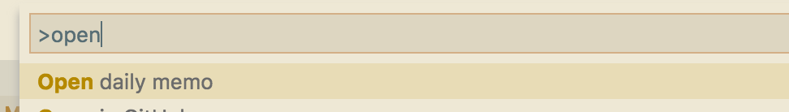

# atom-open-daily-memo package

Provides `Open daily memo` command. It opens `YYYYMMDD.md`.




## Customize

You can customize direcotory like this.

```json
{
    "daily-memo.directory": "~/Dropbox/memo/2018",
}
```

## Icon

Icon by http://icooon-mono.com/16054-%E8%8A%B1%E3%82%A2%E3%82%A4%E3%82%B3%E3%83%B3/